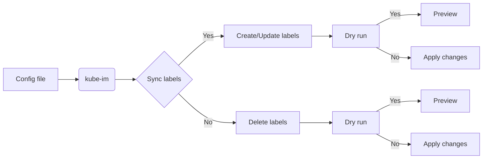
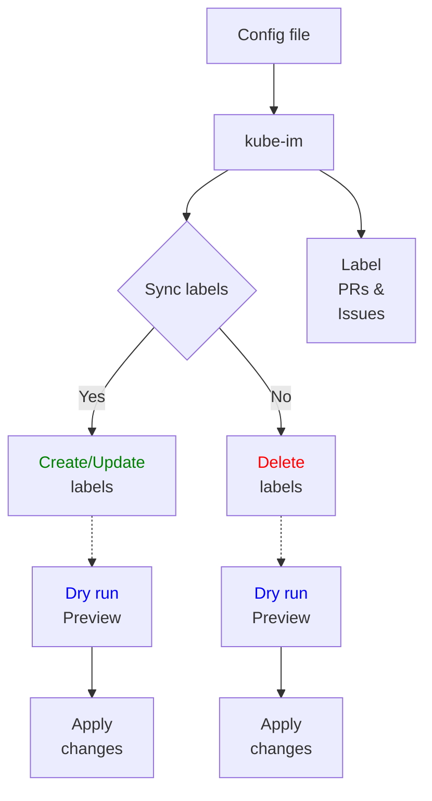

<h1 align="center" style="border-bottom: none">
    <b>
        <a href="https://docker.nsddd.top">kube-im</a><br>
    </b>
</h1>
<h3 align="center" style="border-bottom: none">
      ⭐️  sync labels between repos and org.  ⭐️ <br>
<h3>


<p align=center>
<a href="https://goreportcard.com/report/github.com/kubecub/kube-im"></a>
<a href="https://github.com/issues?q=org%kubecub+is%3Aissue+label%3A%22good+first+issue%22+no%3Aassignee"></a>
<a href="https://github.com/kubecub/kube-im"></a>
<a href="https://join.slack.com/t/kubecub/shared_invite/zt-1se0k2bae-lkYzz0_T~BYh3rjkvlcUqQ"></a>
<a href="https://github.com/kubecub/kube-im/blob/main/LICENSE"></a>
<a href="https://golang.org/"></a>
</p>

</p>

<p align="center">
    <a href="./README.md"><b>English</b></a> •
    <a href="./README_zh-CN.md"><b>中文</b></a>
</p>

</p>

----

## 🧩 Awesome features

+ Highly Scalable - The system is built with a microservices architecture and deployed on Kubernetes, which allows it to handle gh volumes of messages and scale seamlessly.

+ Highly Available - By leveraging Kubernetes deployments and services, the system achieves high availability of all components d avoids single points of failure.

+ Distributed Messaging - The system uses a distributed messaging queue to relay messages between users in a reliable and alable way. Even in the event of component failures, messages will not be lost.

+ Group Chat & Conferencing - The system supports creating group chats and online conferences where multiple users can mmunicate and collaborate in real-time. Screen sharing and file sharing are enabled.

+ Offline Messaging - Users can send messages to each other even when the recipients are offline. Their messages will be stored d delivered once they come back online. 

+ Rich Media Support - The system allows users to seamlessly share photos, voice messages, videos and files within chats and oups.  

+ Secure & Compliant - The system is built with a strong emphasis on security, privacy and compliance. Encryption, thentication and authorization mechanisms ensure sensitive data is protected. 

+ Open Source - The system is open source, freely available for anyone in the community to use, modify and deploy. Openness sters faster innovation.

+ Actively Maintained - The system is actively maintained by the open source community, with frequent updates and continuous provements to functionality, stability, security and performance.

+ Easy to Deploy - With the power of Kubernetes and Helm, the system is designed to be easily deployed and upgraded on various environments. Minimal configuration and scaling is required for most use cases.

+ Does this cover the main awesome features you want to highlight for the project? Let me know if you would like me to modify or add any points. I'm happy to refine this further.

Does this cover the main awesome features you want to highlight for the project? Let me know if you would like me to modify or add any points. I'm happy to refine [this further](https://github.com/kubecub/kube-im/issues/new/choose). 


**Labels denger:**
The labels are designed semantic and standard. We provide labels for priority, type, status etc. You can refer to the [label doc](https://github.com/kubecub/kube-im/labels) to get more info.


## 🛫 Quick start

> **Note**: You can get started quickly with kube-im.


<details>
  <summary>Work with Makefile</summary>

```bash
❯ make help    # show help
❯ make build   # build binary exporter and syncer
❯ echo 'export PATH=$PATH:/path/to/_output/platforms/linux/amd64/' | tee -a ~/.zshrc;source ~/.zshrc
```

</details>
<details>
  <summary>Work with actions</summary>

Actions provide handling of PR and issue.
We used the bot [🚀@kubbot](https://github.com/kubbot), It can detect issues in Chinese and translate them to English, and you can interact with it using the command `/comment`.

Comment in an issue:

```bash
❯ /intive
```

</details>
<details>
  <summary>Use</summary>

```bash
❯ ./_output/platforms/linux/amd64/
```

</details>
<details>
  <summary>Work with Docker</summary>

```bash
❯ make deploy
```

</details>


## 🕋 architecture diagram


**MVC Architecture Design:**


## 🤖 File Directory Description

Catalog standardization design structure:

```bash
.kube-im
├── CONTRIBUTING.md          # Contribution guidelines
├── LICENSE                  # License information
├── Makefile                 # Makefile for building and running the project
├── README.md                # Project overview in English
├── README_zh-CN.md          # Project overview in Chinese
├── api                      # API-related files
│   ├── OWNERS               # API owners
│   └── README.md            # API documentation
├── assets                   # Static assets, such as images and stylesheets
│   └── README.md            # Assets documentation
├── build                    # Build-related files
│   ├── OWNERS               # Build owners
│   └── README.md            # Build documentation
├── cmd                      # Command-line tools and entry points
│   ├── OWNERS               # Command owners
│   └── README.md            # Command documentation
├── configs                  # Configuration files
│   ├── OWNERS               # Configuration owners
│   ├── README.md            # Configuration documentation
│   └── config.yaml          # Main configuration file
├── deploy                   # Deployment-related files
│   ├── OWNERS               # Deployment owners
│   └── README.md            # Deployment documentation
├── docs                     # Project documentation
│   ├── OWNERS               # Documentation owners
│   └── README.md            # Documentation index
├── examples                 # Example code and usage
│   ├── OWNERS               # Example owners
│   └── README.md            # Example documentation
├── init                     # Initialization files
│   ├── OWNERS               # Initialization owners
│   └── README.md            # Initialization documentation
├── internal                 # Internal application code
│   ├── OWNERS               # Internal code owners
│   ├── README.md            # Internal code documentation
│   ├── app                  # Application logic
│   ├── pkg                  # Internal packages
│   └── utils                # Utility functions and helpers
├── pkg                      # Public packages and libraries
│   ├── OWNERS               # Package owners
│   ├── README.md            # Package documentation
│   ├── common               # Common utilities and helpers
│   ├── log                  # Log utilities
│   ├── tools                # Tooling and scripts
│   ├── utils                # General utility functions
│   └── version              # Version information
├── scripts                  # Scripts for development and automation
│   ├── LICENSE_TEMPLATES    # License templates
│   ├── OWNERS               # Script owners
│   ├── README.md            # Script documentation
│   ├── githooks             # Git hooks for development
│   └── make-rules           # Makefile rules and scripts
├── test                     # Test files and test-related utilities
│   ├── OWNERS               # Test owners
│   └── README.md            # Test documentation
├── third_party              # Third-party dependencies and libraries
│   └── README.md            # Third-party documentation
├── tools                    # Tooling and utilities for development
│   └── README.md            # Tool documentation
└── web                      # Web-related files, such as HTML and CSS
    ├── OWNERS               # Web owners
    └── README.md            # Web documentation
```

## 🗓️ community meeting

We welcome everyone to join us and contribute to kube-im, whether you are new to open source or professional. We are committed to promoting an open source culture, so we offer community members neighborhood prizes and reward money in recognition of their contributions. We believe that by working together, we can build a strong community and make valuable open source tools and resources available to more people. So if you are interested in kube-im, please join our community and start contributing your ideas and skills!

We take notes of each [biweekly meeting](https://github.com/kubecub/kube-im/issues/2) in [GitHub discussions](https://github.com/kubecub/kube-im/discussions/categories/meeting), and our minutes are written in [Google Docs](https://docs.google.com/document/d/1nx8MDpuG74NASx081JcCpxPgDITNTpIIos0DS6Vr9GU/edit?usp=sharing).

kube-im maintains a [public roadmap](https://github.com/kubecub/community/tree/main/roadmaps). It gives a a high-level view of the main priorities for the project, the maturity of different features and projects, and how to influence the project direction.

## 🤼‍ Contributing & Development

kubecub Our goal is to build a top-level open source community. We have a set of standards, in the [Community repository](https://github.com/kubecub/community).

If you'd like to contribute to this kube-im repository, please read our [contributor documentation](https://github.com/kubecub/kube-im/blob/main/CONTRIBUTING.md).

Before you start, please make sure your changes are in demand. The best for that is to create a [new discussion](https://github.com/kubecub/kube-im/discussions/new/choose) OR [Slack Communication](https://join.slack.com/t/kubecub/shared_invite/zt-1se0k2bae-lkYzz0_T~BYh3rjkvlcUqQ), or if you find an issue, [report it](https://github.com/kubecub/kube-im/issues/new/choose) first.


## 🚨 License

Kubecub is licensed under the MIT License, Version 2.0. See [LICENSE](https://github.com/kubecub/kube-im/tree/main/LICENSE) for the full license text.

[](https://app.fossa.com/projects/git%2Bgithub.com%2Fkubecub%2Fkube-im?ref=badge_large)


## 🔮 Thanks to our contributors!

<a href="https://github.com/kubecub/kube-im/graphs/contributors">
  
</a>
